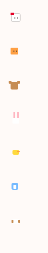
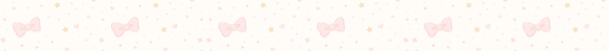
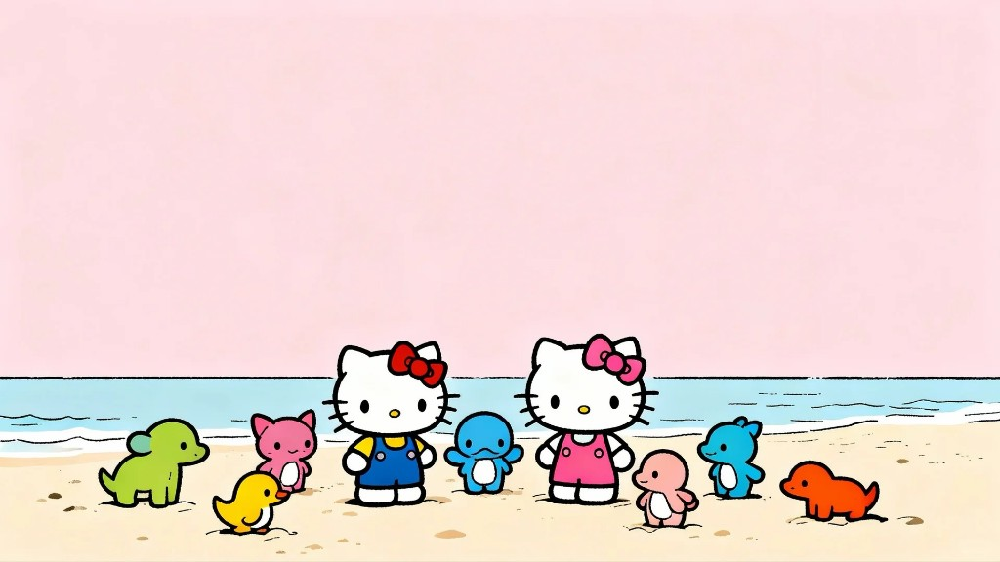
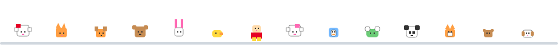
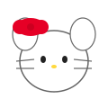
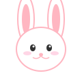
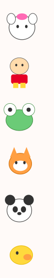

<div align="center">
<table width="100%" cellspacing="0" cellpadding="0">
<tr>
<td width="100" valign="top" align="center" bgcolor="#fffaf8">
  
</td>
<td align="center" bgcolor="#fffaf8">



<div align="center">
  
</div>

<p align="center">
  
</p>

<p align="center">
  
</p>

<p align="center">
  
</p>

<p align="center">
  
  
  
</p>

<p align="center">
  
</p>


### 🌸 About Me

```text
Hi, I'm pingzi.

I build browser extensions, AI agent experiments, and backend tools
for document and OCR workflows.

I care about clear interfaces, reliable pipelines, and details that
make tools easier to use.
```

<br/>

### 🎀 Featured Projects

| Project | Description | Stack |
| :--- | :--- | :--- |
| [**GPT-Voyager**](https://github.com/LondonBella-cpu/GPT-Voyager) | ChatGPT productivity extension for sessions, prompt templates, formulas, and Mermaid capture | `TypeScript` |
| [**forgepilot-agent**](https://github.com/LondonBella-cpu/forgepilot-agent) | Agent development experiments and local tooling | — |
| [**IM-Agent**](https://github.com/LondonBella-cpu/IM-Agent) | Intelligent assistant patterns for IM workflows | — |
| [**proofreading-backend-ocr-pipeline**](https://github.com/LondonBella-cpu/proofreading-backend-ocr-pipeline) | Backend OCR pipeline for proofreading workflows | `Python` |

<br/>


### 🎵 最近在听 · NetEase Cloud Music

<p align="center">
  
  <a href="https://music.163.com/#/user/home?id=3409558972">
    
  </a>
  
</p>

<br/>


### 📊 GitHub Stats

<p align="center">
  
  
</p>

<br/>

### 🛠️ Tech Stack

<p align="center">
  
  
  
  
  
</p>

<br/>

### 🐍 Pink Contribution Snake

<picture>
  <source media="(prefers-color-scheme: dark)" srcset="https://raw.githubusercontent.com/LondonBella-cpu/LondonBella-cpu/output/github-snake-dark.svg" />
  <source media="(prefers-color-scheme: light)" srcset="https://raw.githubusercontent.com/LondonBella-cpu/LondonBella-cpu/output/github-snake.svg" />
  
</picture>

<br/>

### 🐾 Visitor Count

<p align="center">
  
</p>

<br/>

*Thanks for stopping by.*


</td>
<td width="100" valign="top" align="center" bgcolor="#fffaf8">
  
</td>
</tr>
</table>
</div>
